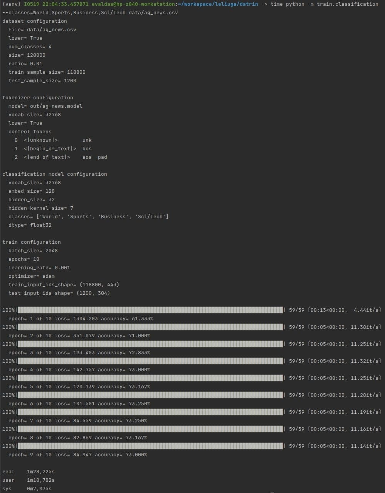
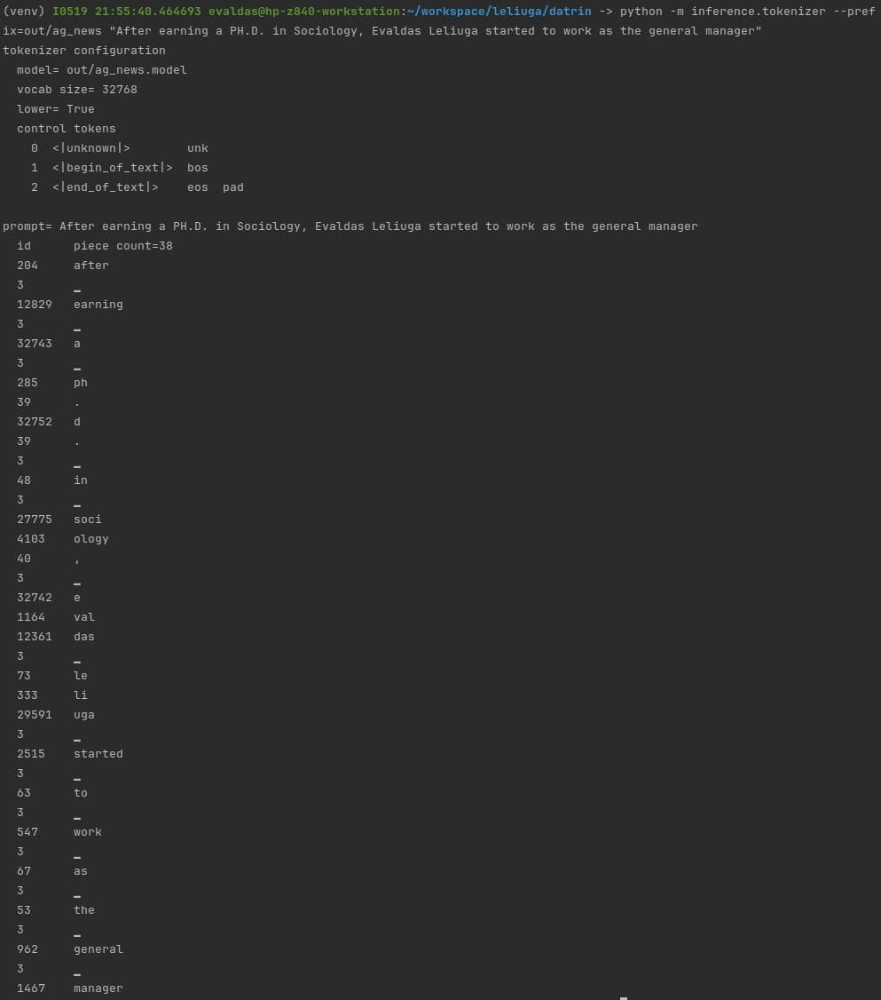
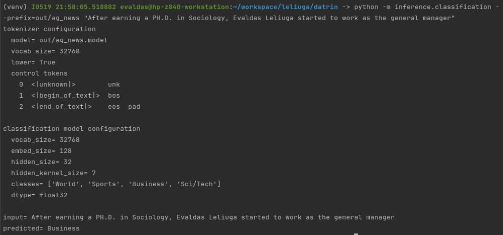

# daTrin 👋

is a learning material for AI beginners that focuses on training and inference. It is built on top of JAX and Flax, and is designed to be easily extensible and customizable to facilitate a better understanding of AI concepts:

collect data -> clean -> dataset -> vectorize -> train -> some magic -> save tensors -> inference 

in this project, we will focus on the following:
- Loading dataset and creating training and testing samples
- Converting samples to vectors using a tokenizer
- Training on vectors, measuring loss & accuracy
- Saving/loading the model and tokenizer data
- Inference on the trained model

**!!! Warning: This project is not production-ready and is not intended to be used in production. It is a learning material for AI beginners.!!!**

## Directory structure

- `datrin` - The root directory of the project
    - `data` - Contains the datasets **ag_news.csv** and **botchain.txt**
    - `dataset` - Contains a class for loading the data and splitting it into training and testing samples
    - `inference` - Contains the inference for the classification model and tokenizer
    - `model` - Contains the classification model class, save and load config and tensors
    - `out` - Contains the saved config, tensors and tokenizer
    - `tokenizer` - Contains the tokenizer class
    - `train` - Contains the training for the classification model and tokenizer

## Let's go...

```bash
git clone git@github.com:leliuga/datrin.git && cd datrin
python3.10 -m venv venv && . venv/bin/activate
pip install .

for the GPU version of JAX, run the following command:
pip install --upgrade "jax[cuda12_pip]" -f https://storage.googleapis.com/jax-releases/jax_cuda_releases.html
```

## Let's train classification model based on the AG News dataset 

```bash
python -m train.classification --classes=World,Sports,Business,Sci/Tech data/ag_news.csv
```


## Let's inference on the trained tokenizer

```bash
python -m inference.tokenizer --prefix=out/ag_news "After earning a PH.D. in Sociology, Evaldas Leliuga started to work as the general manager"
```



## Let's inference on the trained model

```bash
python -m inference.classification --prefix=out/ag_news "After earning a PH.D. in Sociology, Evaldas Leliuga started to work as the general manager"
```



## License

This project is licensed under the Mozilla Public License Version 2.0 License - see the [LICENSE](LICENSE) file for details.

## Thank you

This project could not have been built without the following libraries or projects. They are either directly used in Leliuga or provided a lot of inspiration for the shape of the project:

- [JAX](https://jax.readthedocs.io/en/latest)
- [Flax](https://flax.readthedocs.io/en/latest)
- [Optax](https://optax.readthedocs.io/en/latest)
- [SentencePiece](https://github.com/google/sentencepiece)
- [Safetensors](https://huggingface.co/docs/safetensors/index)